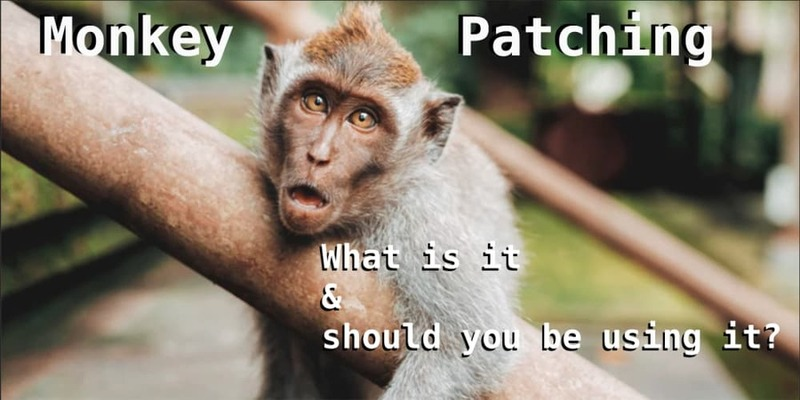
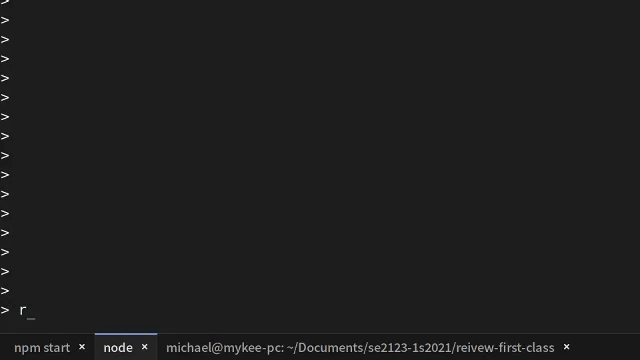

Higher-order Functions
----------------------


### Higher-order functions

* A higher order function is a function that:
  - takes a function as an argument, or
  - returns a function.
  - or both.  `true` || `true` === `true`
* you've mostly used **first order functions** during your freshmen years
  - which don't take a function as an argument nor return a function as output.
  - unless your IED project is in Flutter, which uses lots of HOFs in its API
    + example: `setState(() { yourChangesHere() })`


### HOFs use First-class functions

```js
// The first parameter of `setTimeout` is a function
setTimeout(() => {
  console.log("ssscccrrreeeaaammm!");
}, 5000);

// The second param of `String.replace` can be a function
const message = "hehe you're hilarious, hahahahaha, \n" +
              'so funny llllooolllllzzzz, and cute hihi ♥';

const loudLaughs = match => match.toUpperCase();
// > ES2021 `replaceAll`, <= ES2020 use //g in regex
const emphasizedLaughs = 
  message.replace(/(h[aei]){2,}|l+o+l+z*/g, loudLaughs);
console.log(emphasizedLaughs);
```

<pre>
HEHE you're hilarious, HAHAHAHAHA, 
so funny LLLLOOOLLLLLZZZZ, and cute HIHI ♥ */
</pre>


#### A forbidden jutsu:  monkey-patching (1/2)



- add/modify JS methods without inheritance


#### A forbidden jutsu:  monkey-patching (2/2)

```js
// can't use arrow function here, since `this` will be wrong
Number.prototype.times = function times(task) {
  for (let i = 0; i &lt; this; i++) {
    task();
  }
}

(5).times(() => { // punctuations make this ugly in JS though
   console.log('hehe');
});
```

* [Ruby](https://ruby-doc.org/core-2.5.0/Integer.html) and [Groovy](http://docs.groovy-lang.org/latest/html/groovy-jdk/java/lang/Number.html#times(groovy.lang.Closure)) actually have the `times` method

```ruby
5.times {|i| print i, " " }   #=> 0 1 2 3 4
```

```groovy
10.times {
  println it // print numbers from 0 to 9
}
```


### What use are functions that return a function?

* `setTimeout` and `times` expect arg-less fn
  - what if you need extra things in the function?

```js
const random3to9 = () => Math.trunc(Math.random() * 7) + 3;
const randomlyRepeatLetter = 
  letter => letter.repeat(random3to9());

function scream(phrase, loud) {
  const lengthenedShout = phrase
    .split('')
    .map(randomlyRepeatLetter)
    .join('');
  console.log(loud ? 
    lengthenedShout.toUpperCase() : lengthenedShout);
}
```


#### Testing that our `scream` function works

```
> scream('no', true)
NNNNNNNNNOOO

> scream('die', false)
dddiiieeeeeee

> scream('argh', true)
AAAAAARRRRGGGGGGGGHHHHH
```

After 5 seconds, `setTimeout` will call `scream` with no args, i.e. `scream()`

```js
setTimeout(scream, 5000) // won't work, WHY?
setTimeout(scream('ouch', false), 5000) // won't work, WHY?
```

What do you think will work?


#### We make scream return an arg-less function!

```js
function scream(phrase, loud) {
  return () => {
    const lengthenedShout = phrase
      .split('')
      .map(randomlyRepeatLetter)
      .join('');
    console.log(loud ? 
      lengthenedShout.toUpperCase() : lengthenedShout);
  }
}
```

```js
> scream('ouch', true)
[Function (anonymous)]
```
* Remember it returns a function, so we `call()` it

```js
> scream('ouch', true)()
OOOOOOOOOUUUUUUUUUCCCHHHHHH
```


### Using it in `setTimeout`



* The result of `scream('help', false)` is:
  + a no-arg function, compatible with `setTimeout`!


### Templates, with missing info


* You fill in the blanks, right?
  - with your own name and position


### Templates, with missing steps

* Steps for a hot drink
  1. boil water
  2. brew, but depends on the drink
     + [grind coffee beans, brew in French press](https://www.youtube.com/watch?v=w3A_Z1J78HY)
     + steep tea bag
     + [microwave melted choco bits with milk](https://www.fifteenspatulas.com/best-hot-chocolate-from-scratch/)
     + salabat?  steamed milk?  hot calamansi?
  3. pour in cup
  4. add condiments
     + coffee: optional creamer, some tsp. sugar
     + tea: honey or mint
     + choco:  marshmallows, milk, sugar
     + unknown future hot drinks: ???


#### Actually an OOP design-pattern, but FP can take inspiration from this!

```js
function makeHotDrink() {
  console.log('Boil water');
  /* Step 2: brew step */
  console.log('Pour water in cup');
  /* Step 4;  add condiments */
}
```

* What's your idea to make this work?
  - drink name as param + if-statements or maps?
  - What principle would this violate, when you touch your code for every new drink you add to
    your automated hot-drink maker?
    + You can use an OOP principle here :-)


#### Remember, functions can _"zip"_ tasks

* Step 2 and 4 are _tasks_ don't you agree?

```js [1-6 | 8-17 | 19-23 | 24-28 | 29-34]
function makeHotDrink(brewStep, finalStep) {
  console.log('Boil water');
  brewStep();
  console.log('Pour water in cup');
  finalStep();
}

const brewCoffee = () => {
  console.log('Grind coffee beans');
  console.log('Brew in French press');
}
const brewTea = () => console.log('Steep tea bag');
const brewHotChoco = () => {
  console.log('Chop chocolate into bits');
  console.log('Melt choco bits in microwave');
  console.log('Mix melted choco in hot milk');
}

const addCoffeeCondiments = (withCream, sugarAmount) => 
  () => {
    console.log(withCream ? 'Adding cream' : 'Just black');
    console.log(`Adding ${sugarAmount} tsp. sugar.`);
  };
const addTeaCondiments = (withHoney, withMint) => 
  () => {
    if (withHoney) console.log('Adding honey');
    if (withMint) console.log('Dropping mint leaves');
  };
const addChocoCondiments = 
  (mallowsCount, milkAmount, sugarAmount) => () => {
    console.log(`Adding ${mallowsCount} pcs. marshmallows.`);
    console.log(`Adding ${milkAmount} mL milk`);
    console.log(`Adding ${sugarAmount} tsp. sugar`);
  };
```


### Sample Runs

```txt [1-7 | 9-15 | 17-22 | 24-28 | 30- 34 | 36-39 | 41-49 | 51-60]
> makeHotDrink(brewCoffee, addCoffeeCondiments(true, 2));
Boil water
Grind coffee beans
Brew in French press
Pour water in cup
Adding cream
Adding 2 tsp. sugar.

> makeHotDrink(brewCoffee, addCoffeeCondiments(false, 1));
Boil water
Grind coffee beans
Brew in French press
Pour water in cup
Just black
Adding 1 tsp. sugar.

> makeHotDrink(brewTea, addTeaCondiments(true, true));
Boil water
Steep tea bag
Pour water in cup
Adding honey
Dropping mint leaves

> makeHotDrink(brewTea, addTeaCondiments(true, false));
Boil water
Steep tea bag
Pour water in cup
Adding honey

> makeHotDrink(brewTea, addTeaCondiments(false, true));
Boil water
Steep tea bag
Pour water in cup
Dropping mint leaves

> makeHotDrink(brewTea, addTeaCondiments(false, false));
Boil water
Steep tea bag
Pour water in cup

> makeHotDrink(brewHotChoco, addChocoCondiments(5, 2, 1))
Boil water
Chop chocolate into bits
Melt choco bits in microwave
Mix melted choco in hot milk
Pour water in cup
Adding 5 pcs. marshmallows.
Adding 2 mL milk
Adding 1 tsp. sugar

> console.log('imma weirdo/barista')
imma weirdo/barista

> makeHotDrink(brewCoffee, addTeaCondiments(true, true))
Boil water
Grind coffee beans
Brew in French press
Pour water in cup
Adding honey
Dropping mint leaves
```

Should the last example be allowed?  If not, what's a good way to do it without classes (coz FP)?


### Template: linear search

```js
function findEvens(numbers) {
  const results = []; // same
  for (const number of numbers) { // same, except vars
    if (number % 2 === 0) { // different
      results.push(number); // same, except vars
    }
  }
  return results; // same
}
```

```js
function findRealFemales(people) {
  const results = [];
  for (const person of people) {
    if (person.gender === 'F' && !person.lgbtq) { // different
      results.push(person); // same, except vars
    }
  }
  return results; // same
}
```


#### Recreating `filter` with monkey-patching

* The only thing that's different is the `if`-statement
  - In Discrete Math, we call this the predicate
* Dart-lang uses `where`, let's use that method name

```js
Array.prototype.where = function where(predicate) {
  const results = [];
  for (const element of this) {
    if (predicate(element)) { // different step
      results.push(element);
    }
  }
  return results;
}

> [1, 5, 7, 3, 2, 99, 50, 85, 14, 17].where(x => x % 2 === 0)
[ 2, 50, 14 ]
```


### Analyze this properly, coz...

+ It's **YOUR** turn to **RECREATE** (see last bullet)
  - Problem Set 01b is recreating all Array HOFs in JS:
    + filter (I did it for you 😠)
    + find
    + findIndex
    + map
    + reduce
    + reduceRight
    + every
    + some
  - **DO NOT USE THE BUILT-IN HOFs**, you'll surely get **ZERO**

```js
Array.prototype.where = Array.prototype.filter // ❌❌❌ 5.0
```