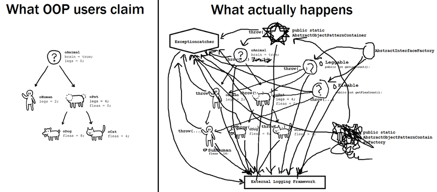
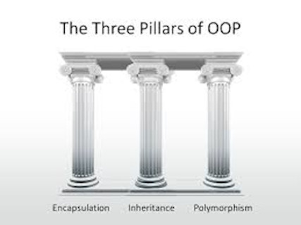
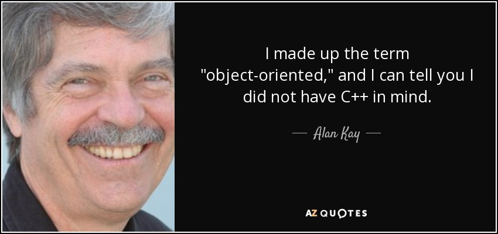
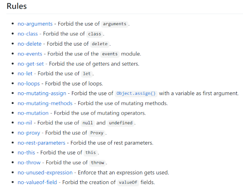
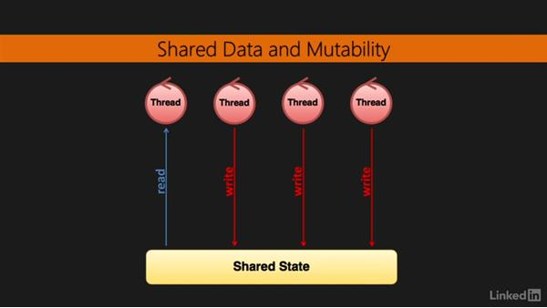
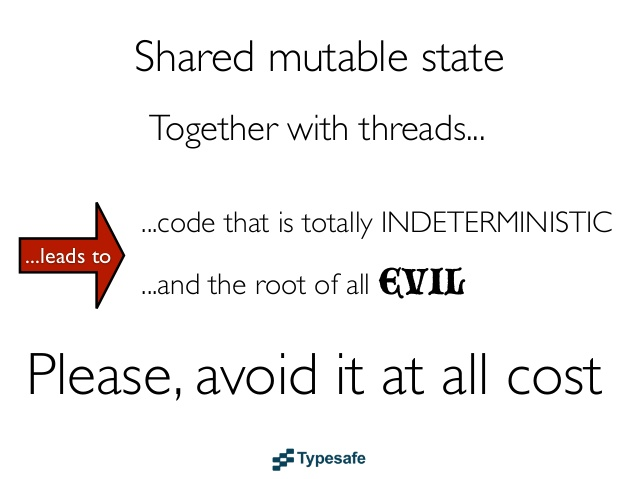

First-class Functions
---------------------

<small>
  <span style="color: darkblue;">&lt;</span><span style="color: goldenrod;">/&gt;</span>
  <a href="https://github.com/psse-cpu/se2123-first-class-fns-slides">
    https://github.com/psse-cpu/se2123-first-class-fns-slides
  </a>
</small>

<h4 style="margin-top: 192px; font-size: 0.85em;">
  <span class="course-code">SE 2123</span>
  <span class="course-title">Software Development III</span>
</h4>

<div style="font-size: 0.75em; margin-top: 16px;">
  <b>Richard Michael Coo</b> |

  <a href="https://github.com/myknbani">
    
  </a>
  <a href="https://twitter.com/myknbani">
    
  </a>
  <span style="vertical-align: middle">@myknbani</span>
</div>


### Outline

- pain points of imperative and (OOP) programming
- life without first-class functions
  * timers
  * GUI event handling
  * loops
- first-class functions
  * tasks as functions
- higher-order functions


### First-class Functions


* This lesson is all about a very important FP feature
* but first, let's find out why we're trying to study FP


### Pains of OOP



[Read this article, also linked on Canvas](https://medium.com/better-programming/object-oriented-programming-the-trillion-dollar-disaster-92a4b666c7c7)


### C++/Java/C# OOP != Alan Kay OOP

* Modern OOP is just class-based syntax with procedural semantics

```cpp [1-12 | 14-21]
// writing C++ in a way familiar to Dart coders
#include &lt;stdio.h&gt;

class Dog {
  public:
    const char* name;
    int weight;

    void bark() {
      printf("%s says Arf arf!\n", name);
    }
};

int main() {
  Dog dog;
  dog.name = "Michael\0";
  dog.weight = 15;
  dog.bark();

  return 0;
}
```


### Sugarcoated procedural syntax

* What advantage does the previous code have?

```cpp [3-6 | 8-13 | 15-22]
#include &lt;stdio.h&gt;

struct Dog {
  const char* name;
  int weight;
};

// namespaces can "prefix" and group our procedures/fns
namespace DogFns {
  void bark(struct Dog dog) {
    printf("%s says Arf arf!\n", dog.name);
  }
}

int main() {
  struct Dog dog;
  dog.name = "Michael\0";
  dog.weight = 15;
  DogFns::bark(dog);

  return 0;
}
```


### What about the 3 (or 4) pillars?



- [Goodbye OOP by Charles Scalfani](https://medium.com/@cscalfani/goodbye-object-oriented-programming-a59cda4c0e53)
- [OOP: The Trillion Dollar Disaster by Ilya Suzdalnitsk](https://medium.com/better-programming/object-oriented-programming-the-trillion-dollar-disaster-92a4b666c7c7)


### Alan Kay envisioned a different OOP

* Unfortunately, modern OOP inherited C++'s idea
  - Java, C#, ES2015+, PHP, Python, **Dart**, etc.




### OOP: The Trillion Dollar Mistake

* No speed limits (coz imperative)


### FP: Full of `no-xyz`



* Every rule begins with **no**!


### Shared, mutable, scattered state

> I think that large objected-oriented programs struggle with increasing complexity as you build 
> this large object graph of mutable objects. You know, trying to understand and keep in your mind 
> what will happen when you call a method and what will the side effects be.

<small style="color: brown">Rich Hickey, Clojure Creator</small>


#### Shared, mutable state means no concurrency

* Forget Java concurrency features
  - or just think of the ever-popular, which has no `synchronized` keyword




#### Shared, mutable state + threads = death




### Brain hurting?


* As sophomores, not even your IED project might be large enough to give you bad experiences with
  shared mutable state.


### But they're something to remember

* Just look back on these drawbacks a year later


### Don't forget, OOP is still king

<iframe width="800" height="450" src="https://www.youtube.com/embed/QyJZzq0v7Z4" frameborder="0" allow="accelerometer; autoplay; encrypted-media; gyroscope; picture-in-picture" allowfullscreen></iframe>

Still true as of 2020