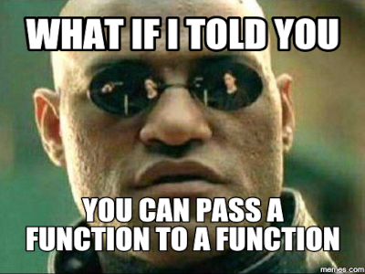

Life without first-class functions
----------------------------------


### What are first-class functions?

* An important FP-feature where functions can be treated as values
  - treat them like any other variable
  - pass them as args, return functions from functions




### An inspiration

Do one of three tasks, without `if`-statements!

```js [1-9 | 11-18 | 20-26]
import readline from 'readline-sync';

function biking() {
  console.log('Zipping thru Iloilo City bike lanes!');
}

function hacking() {
  console.log('What sem do we learn hacking daw?? 😂');
}

// look ma!  I can assign an anonymous arrow function
// to a const variable!
const praying = () => {
  console.log('Pray without ceasing - 1 Thess 5:17');
}

// look ma!  I can create an array of functions!
const tasks = [biking, hacking, praying];

console.log('1) biking 2) hacking 3) praying');
const taskNumber = Number(readline.question('Enter task #: '));

const task = tasks[taskNumber - 1];
console.log("Type of `task`:", typeof task);

task(); // it's a function, use parens to call
```


### Sample Run


### Why do we need our first lesson?


### Once upon a time...

* ...popular OOP languages had no first-class function
  - and they have Timers to do task X after 5 seconds

```java [1-9 | 11-25]
import java.util.Timer;
import java.util.TimerTask;

public class TimerDemo {
  public static void main(String[] args) {
    var timer = new Timer();
    timer.schedule(new ShoutTask(timer), 5000);
  }
}

// TimerTask is abstract, and needs to be overriden
class ShoutTask extends TimerTask {
  private Timer timer;

  public ShoutTask(Timer timer) {
    this.timer = timer;
  }

  @Override
  public void run() {
    System.out.println("AAAAARRRRGGGGHHHH!");
    // task is finished, cancel it
    timer.cancel();
  }
}
```


### and it works, but was painful


* Passing the Timer to TimerTask
  - just for cancellation
* The actual shouting task is only one line of code
  - Google for Java "hello world" jokes :-)


### and jokes are always half-meant


### Handling click events without first-class functions

```java [1-13 | 15-20 | 22-29]
import javax.swing.*;
import java.awt.*;
import java.awt.event.*;

public class Gui extends JFrame {
  public Gui() {
    setLayout(new FlowLayout());
    var contentPane = getContentPane();

    var button = new JButton("Say Hello!");
    button.addActionListener(new Greeter());
    contentPane.add(button);
  }

  public static void main(String[] args) {
    var gui = new Gui();
    gui.setSize(400, 300);
    gui.setVisible(true);
  }
}

class Greeter implements ActionListener {
  @Override
  public void actionPerformed(ActionEvent event) {
    JOptionPane.showMessageDialog(null, 
      "Hello PSSE!", "Greetings!", 
      JOptionPane.INFORMATION_MESSAGE);
  }
}
```


### GUI Sample Run


* You create an object to handle a click event
  - this listener object is added to the button via `addActionListener`


### Loops

* I showed a preview during orientation
  - [but share your own bloopers with linear search using loops](https://cpu.instructure.com/courses/2102/discussion_topics/12429)


```js
const evens = []
const numbers = [38, 11, 29, 14, 88, 51, 30, 8]

for (const number of numbers) {
  if (number % 2 === 0) evens.push(number)
}

console.log(evens)
```


### In the blue corner, first-class fns!

```html
<!-- Run in your browser -->
&lt;html&gt;
  &lt;body&gt;
    &lt;button id="greeter"&gt;Say Hello!&lt;/button&gt;

    &lt;script&gt;
      function sayHello() {
        alert("Hello PSSE!");
      }

      const button = document.getElementById('greeter');
      button.onclick = sayHello; // not sayHello()
    &lt;/script&gt;
  &lt;/body&gt;
&lt;/html&gt;
```

* Double-click your file, it should probably run in your browser (or _"open with Chrome"_)


### Scoreboard after 1 round:  <br>First-class fns 1, objects 0


* The judges say:
  + `sayHello` is almost like `void actionPerformed`
  + without the surrounding `class`
  + hey fans, who's your winner?


### Round 2 - Timers

```js []
function sayHello() {
  console.log("Hello PSSE!");
}

// pass sayHello as an argument
setTimeout(sayHello, 5000);

// or use an anonymous arrow function
setTimeout(() => {
  console.log("it's not a fight, it's a massacre")
}, 8000);

const pray = () => console.log('Almighty God...');
const readBible = () => console.log("Today's verse is...");
const tasks = [pray, readBible, pray];

for (let i = 1; i &lt;= tasks.length; i++) {
  setTimeout(tasks[i - 1], i * 1000);
}
```

* Note Dart also uses a function for the _"timer task"_


#### And the winner by submission - <br>first class functions

<div style="display: flex">


</div>


### Have you noticed?

* Functions are a good way of _"enapsulating"_ tasks
  - take that OOP ~~hashira~~ pillar!
  - Java's class is named `TimerTask` 😱😱😱
* Functions act like _"zip files"_ for several LOC
  - you can only upload 1 file in Canvas, but you have 3 `.dart` files, what you do?
    + zip your 3 `.dart` files!
  - you can only pass one _"thing"_ to `setTimeout`, but you have 3 lines of code, what you do?
    + put your 3 LOC in a function!


#### Java got envious, FP features added in Java 8


P.S. you'll study **design patterns** in SE-2124
<sup style="size: 0.5em; color: mediumblue">3rd subterm</sup>
